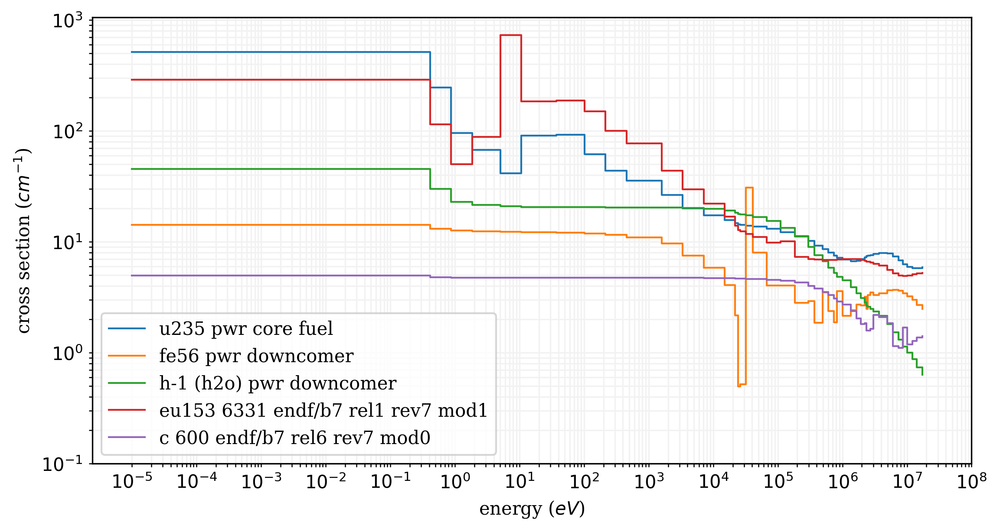

# BUGLE-VITAMIN-reader
I developed a python class that reads cross-sections libraries with the 'bcd' file extension with the BUGLE and VITAMIN shielding libraries in mind. The libraries can be loaded by a simple command:

```python
from reader import *
book = multigroup_library(file_name)
```

The fine-group VITAMIN and coarse-group BUGLE libraries are multigroup shielding libraries that have useful cross sections for different isotopes and compositions that have been collapsed with different weighting spectrums that are representative of regions in typical shielding materials. Updated versions are available through RSICC where they are developed by the transport group that develops SCALE. The MAVRIC shielding library is based on this with a higher energy group to go to 20MeV for neutrons (and maybe photons). The same libraries from MAVRIC are provided in ADVANTG.

I also have included a plot_xs.png file that can be edited to plot different distributions from a loaded library like the following:


